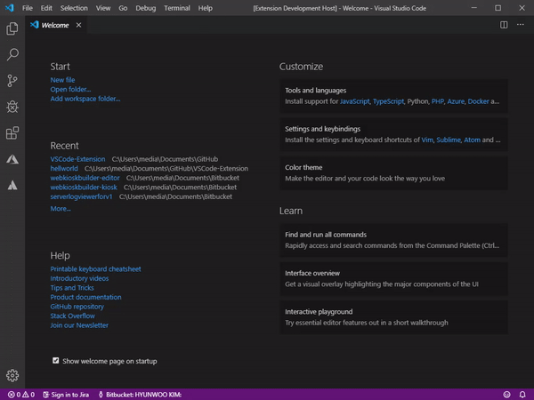

# VSCode-Extension
나만의 첫 VSCode 확장 프로그램

Reference [here](https://code.visualstudio.com/api/get-started/your-first-extension).



Dev log

```
Windows PowerShell
Copyright (C) Microsoft Corporation. All rights reserved.
새로운 크로스 플랫폼 PowerShell 사용 https://aka.ms/pscore6

PS C:\Users\media\Documents\GitHub\VSCode-Extension> npm install -g vsce
C:\Users\media\AppData\Roaming\npm\vsce -> C:\Users\media\AppData\Roaming\npm\node_modules\vsce\out\vsce
+ vsce@1.69.0
added 66 packages from 77 contributors in 4.76s
PS C:\Users\media\Documents\GitHub\VSCode-Extension> vsce package
 ERROR  Missing publisher name. Learn more: https://code.visualstudio.com/api/working-with-extensions/publishing-extension#publishing-extensions
PS C:\Users\media\Documents\GitHub\VSCode-Extension> vsce package
Executing prepublish script 'npm run vscode:prepublish'...

> hellworld@0.0.1 vscode:prepublish C:\Users\media\Documents\GitHub\VSCode-Extension


> hellworld@0.0.1 compile C:\Users\media\Documents\GitHub\VSCode-Extension
> tsc -p ./

 ERROR  Make sure to edit the README.md file before you package or publish your extension.
PS C:\Users\media\Documents\GitHub\VSCode-Extension> vsce package
Executing prepublish script 'npm run vscode:prepublish'...

> hellworld@0.0.1 vscode:prepublish C:\Users\media\Documents\GitHub\VSCode-Extension


> hellworld@0.0.1 compile C:\Users\media\Documents\GitHub\VSCode-Extension
> tsc -p ./

 WARNING  A 'repository' field is missing from the 'package.json' manifest file.
Do you want to continue? [y/N] y
 DONE  Packaged: C:\Users\media\Documents\GitHub\VSCode-Extension\hellworld-0.0.1.vsix (7 files, 3.63KB)
PS C:\Users\media\Documents\GitHub\VSCode-Extension> vsce package
Executing prepublish script 'npm run vscode:prepublish'...

> hellworld@0.0.1 vscode:prepublish C:\Users\media\Documents\GitHub\VSCode-Extension
> npm run compile

> hellworld@0.0.1 compile C:\Users\media\Documents\GitHub\VSCode-Extension
> tsc -p ./

 DONE  Packaged: C:\Users\media\Documents\GitHub\VSCode-Extension\hellworld-0.0.1.vsix (7 files, 3.73KB)
PS C:\Users\media\Documents\GitHub\VSCode-Extension> vsce publish
Executing prepublish script 'npm run vscode:prepublish'...

> hellworld@0.0.1 vscode:prepublish C:\Users\media\Documents\GitHub\VSCode-Extension
> npm run compile


> tsc -p ./

Personal Access Token for publisher '-------': *****************

 ERROR  {"$id":"1","innerException":null,"message":"TF400813: Resource not available for anonymous access. Client authentication required.","typeName":"Microsoft.TeamFoundation.Framework.Server.UnauthorizedRequestExcep
tion, Microsoft.TeamFoundation.Framework.Server","typeKey":"UnauthorizedRequestException","errorCode":0,"eventId":3000}
PS C:\Users\media\Documents\GitHub\VSCode-Extension> vsce publish
Executing prepublish script 'npm run vscode:prepublish'...

> hellworld@0.0.1 vscode:prepublish C:\Users\media\Documents\GitHub\VSCode-Extension
> npm run compile


> hellworld@0.0.1 compile C:\Users\media\Documents\GitHub\VSCode-Extension
> tsc -p ./

Personal Access Token for publisher '-------': ****************************************************
 ERROR  Failed request: (401)
PS C:\Users\media\Documents\GitHub\VSCode-Extension> vsce login -------@-------.ac.kr
        throw new Error(`Invalid publisher name '${publisher}'. Expected the identifier of a publisher, not its human-friendly name.  Learn more: https://code.visualstudio.com/api/working-with-extensions/publishing-extension#publishing-extensions`);
        ^

Error: Invalid publisher name '-------@-------.ac.kr'. Expected the identifier of a publisher, not its human-friendly name.  Learn more: https://code.visualstudio.com/api/working-with-extensions/publishing-extension#p    at Object.validatePublisher (C:\Users\media\AppData\Roaming\npm\node_modules\vsce\out\validation.js:11:15)
    at Object.loginPublisher (C:\Users\media\AppData\Roaming\npm\node_modules\vsce\out\store.js:68:18)
    at Command.program.command.description.action.name (C:\Users\media\AppData\Roaming\npm\node_modules\vsce\out\main.js:97:38)
    at emitTwo (events.js:126:13)
    at Command.emit (events.js:214:7)
    at Command.parseArgs (C:\Users\media\AppData\Roaming\npm\node_modules\vsce\node_modules\commander\index.js:651:12)
    at Command.parse (C:\Users\media\AppData\Roaming\npm\node_modules\vsce\node_modules\commander\index.js:474:21)
    at module.exports (C:\Users\media\AppData\Roaming\npm\node_modules\vsce\out\main.js:122:13)
    at Object.<anonymous> (C:\Users\media\AppData\Roaming\npm\node_modules\vsce\out\vsce:2:18)
PS C:\Users\media\Documents\GitHub\VSCode-Extension> vsce create-publisher -------    
Publisher human-friendly name: (-------)
E-mail:
PS C:\Users\media\Documents\GitHub\VSCode-Extension> vsce create-publisher -------
Publisher human-friendly name: (-------)
E-mail: -------@-------.ac.kr
Personal Access Token: ****************************************************

 DONE  Created publisher '-------'.
PS C:\Users\media\Documents\GitHub\VSCode-Extension> vsce login -------
Publisher '-------' is already known
Do you want to overwrite its PAT? [y/N] N
 ERROR  Aborted
PS C:\Users\media\Documents\GitHub\VSCode-Extension> vsce publish
Executing prepublish script 'npm run vscode:prepublish'...

> hellworld@0.0.1 vscode:prepublish C:\Users\media\Documents\GitHub\VSCode-Extension
> npm run compile


> hellworld@0.0.1 compile C:\Users\media\Documents\GitHub\VSCode-Extension
> tsc -p ./

Publishing -------.hellworld@0.0.1...
 DONE  Published -------.hellworld@0.0.1
Your extension will live at https://marketplace.visualstudio.com/items?itemName=-------.hellworld (might take a few seconds for it to show up).
PS C:\Users\media\Documents\GitHub\VSCode-Extension> 
```